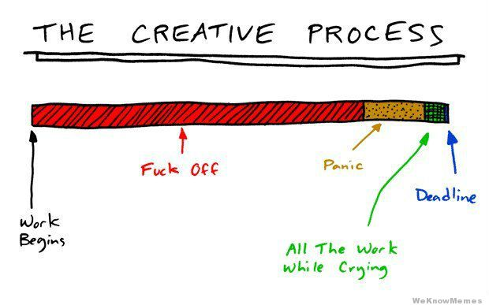

# PARESSE
##  Douce procrastination


### Synopsis :
L’interprète tourne autour d'une zone démarqué au centre de la scène
(carrée LUMIÈRE en douche).  Sous cette zone,  un microphone.

Il l’évite en trouvant autres mouvements à faire en périphérie,  


La fuite est centrifuge comme la trotteuse sur une horloge à aiguille

Un métronome rappel à l’interprète son objectif centrale.

 Chaque notification le rammène vers le centre puis s'éloigne.

Le spectateur,  sait combien de temps il reste à l’execution par projection du temps qui s'écoule

Les entiers s'effrites au compteur,  la panique s’empare de l’interprète,  le travail semble impossible,  le temps trop court,  il est paralisé.

Un instant de courage, une reprise en main,  le defis impossible sera relevé contre sommeil et temporalité une fois le dernier entier entammé.

Mouvements de course contre la montre qui témoigne du stress grandissant quant à une remise imminente .



### Dramaturgie et Temporalité
Paresse s’inspire de cette illustration en matière de division temporelle et dramatique.



La temporalité de la pièce se transpose en sept jours divisé en 4 tableau.

* [Tableau 0 = Début : WorkBegin]
	* Jour 1 :: heure 0
* [Tableau 1 = Fuckoff : Dénie]
 *	[jour 1 à 5]
* [Tableau 2 = Panique : le Temps a passé ]
	* [jour 6 à 7]
* [Tableau 3 = Do All The Work While Crying : ]
	* [Jour 7: Granularité d’heure + minutes + secondes]
* [Tableau 4 = DEADLINE : plus jamais]


### Mise en scène



### Traitement AudioVisuel

#### VIDÉO :
À la vidéo[centrale arrière scène],  un marqueur de temps [ici représenté par l’horloge]


Constamment rappelé à chaque son de métronome, le temps écoulé et le temps qu’il reste sur une barre de progression.  Ici représenté par la barre [creative processe]

En surimpression qui viens de plus en plus masquer la barre de temps, Horloge défillante,  calendrier,  pages webs [de chats cutes] consultés,  appuie le temps qui passe et la fuite par la procrastination.

Le temps s’écoule vite.  

Trame sonore et trame vidéo sont synchronisé

le compteur comporte X champs :

Jour : Heure : Minute : secondes : millis

plus le temps de la composition avance,  plus la granularité du compteur apparaît



#### AUDIO

À la bande-son : Un métronome aux sons de coucou d’horloge,  de reminders,  de courriel entrant,  de sonnerie de téléphone,  de réception de message texte,  de vibration de téléphone,  de notification facebook.   Chaque son qui survient à la double fonction de changer le point de focus de l’interprète,  sa position spatiale,  sa direction,  le  mouvement,   


Le tempo reste le même au courant de la pièce,
sur le métronome s’accroche de plus en plus de notes.
Exemple de progression rythmique  sur des barres de 16 temps en fonction des tableau
```
T[0]->[X][ ][ ][ ]|[ ][ ][ ][ ]|[ ][ ][ ][ ]|[ ][ ][ ][ ]
T[1]->[X][ ][ ][ ]|[ ][ ][ ][ ]|[X][ ][ ][ ]|[ ][ ][ ][ ]
T[2]->[X][ ][ ][ ]|[X][ ][ ][ ]|[X][ ][ ][ ]|[X][ ][ ][ ]
T[3]->[X][ ][X][ ]|[X][ ][X][ ]|[X][ ][X][ ]|[X][ ][X][ ]
T[4]->[X][X][X][X]|[X][X][X][X]|[X][X][X][X]|[X][X][X][X]
```

#### COMPOSITION

Base temporelle : millis

7 minutes totale

7 minutes * 60 (secondes) * 1000(millis) = 420000 unités

trouver une manière de passer

Travailler avec le temps restant.

### Deuxième Étape : Interactivité


### Inspiration :

https://www.youtube.com/watch?v=4P785j15Tzk
